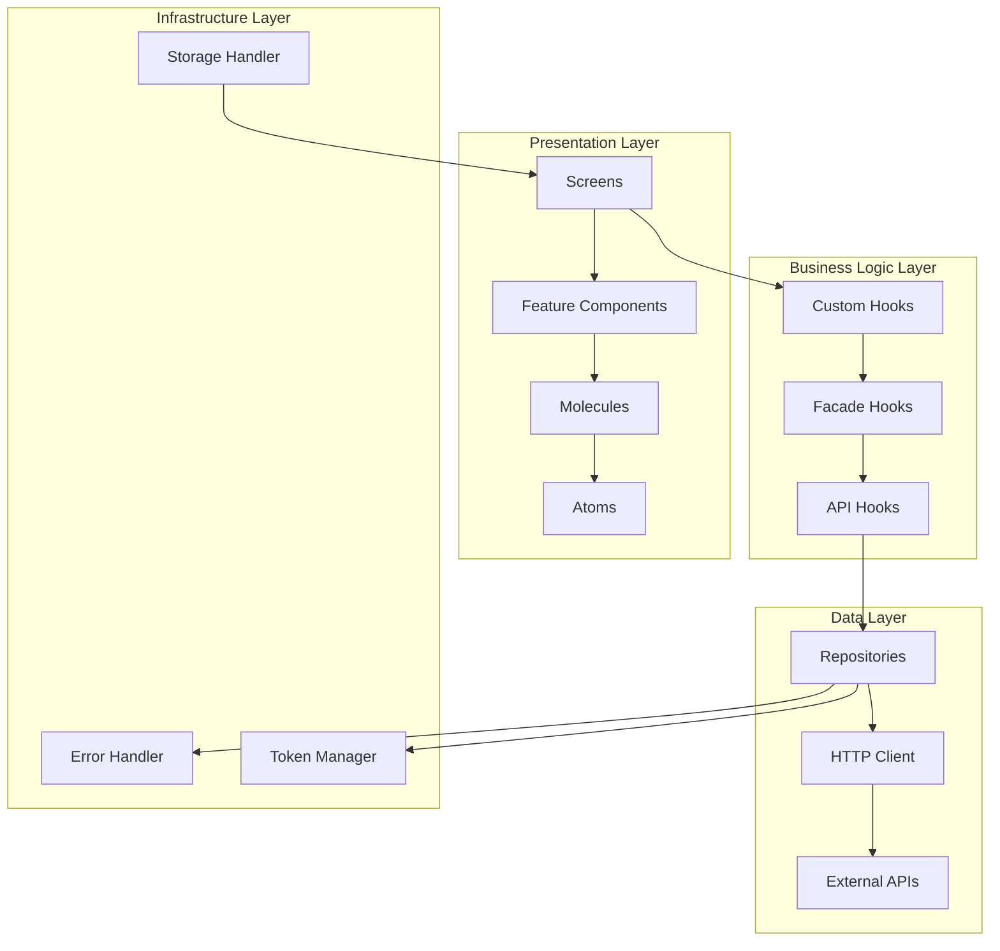
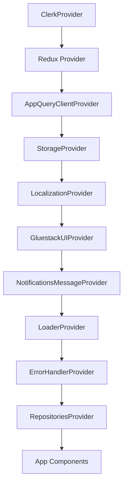
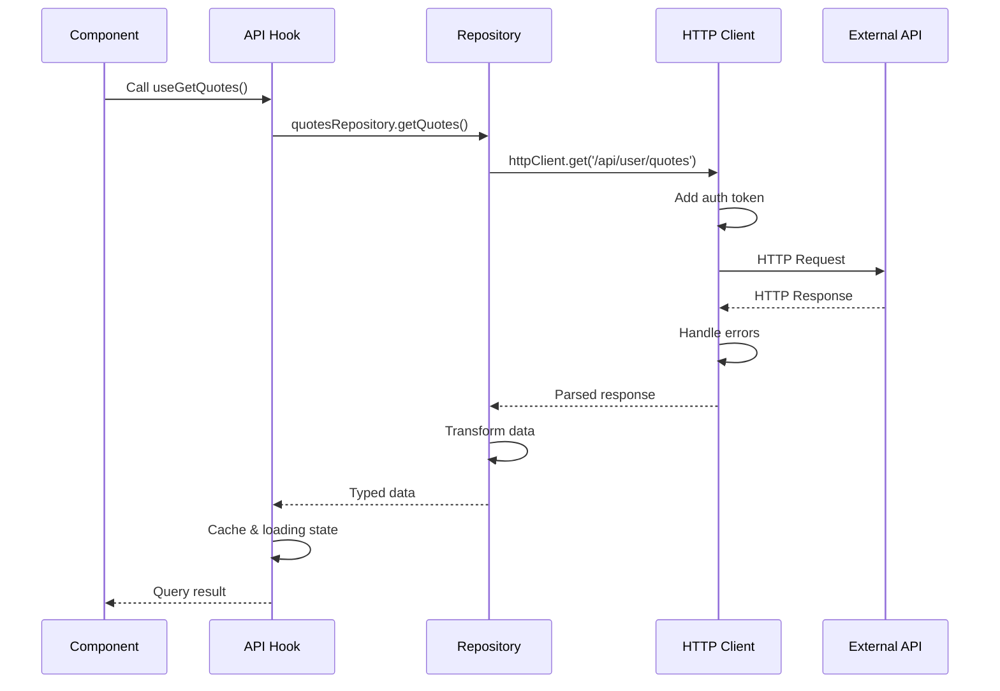
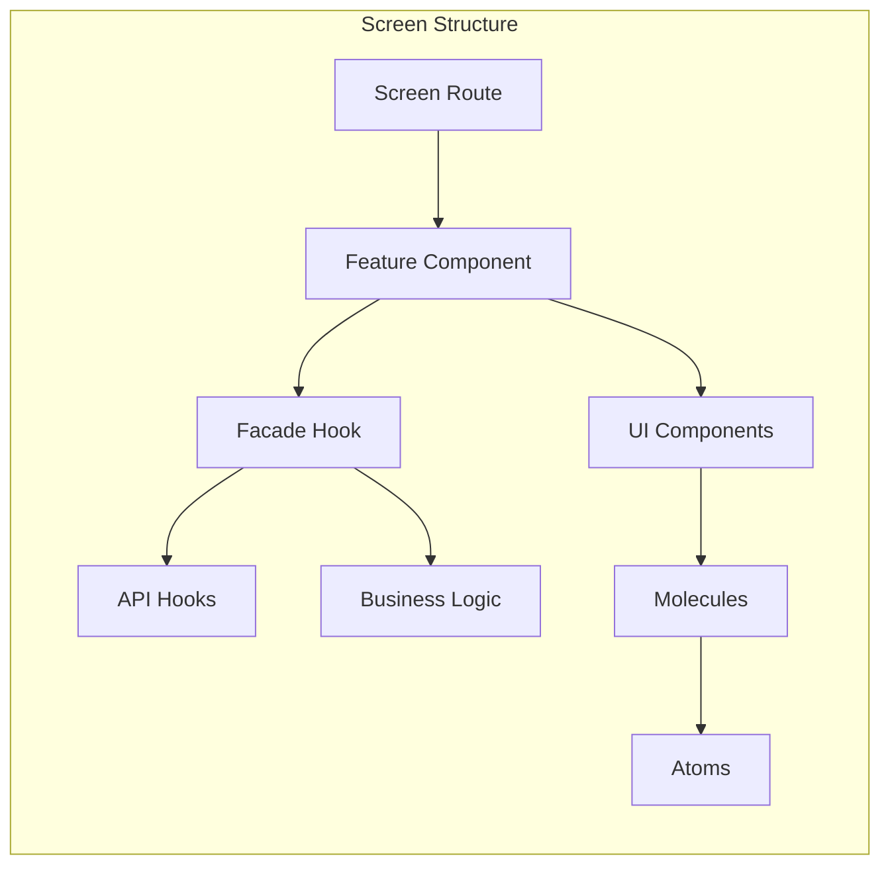
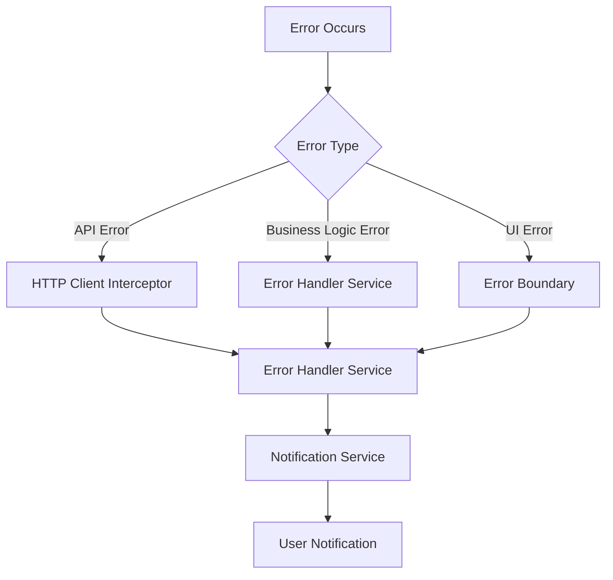

# Cibo App Architecture Documentation

## Overview

This document describes the architecture of the Cibo mobile application built with Expo, targeting iOS, Android, and Web platforms. The architecture follows a layered approach with clear separation of concerns, dependency injection, and comprehensive error handling.

## Table of Contents

1. [Architecture Overview](#architecture-overview)
2. [Project Structure](#project-structure)
3. [Core Providers](#core-providers)
4. [API Flow](#api-flow)
5. [Presentation Flow](#presentation-flow)
6. [Error Handling](#error-handling)
7. [Storage Management](#storage-management)
8. [Authentication](#authentication)

## Architecture Overview

The application follows a clean architecture pattern with the following layers:

- **Presentation Layer**: React components, screens, and UI logic
- **Business Logic Layer**: Custom hooks, facades, and feature-specific logic
- **Data Layer**: Repositories, API clients, and data models
- **Infrastructure Layer**: HTTP clients, storage handlers, and external services



## Project Structure

### Core Directories

```

├── app/                    # Expo Router screens and layouts
│   ├── (auth)/            # Authentication flow
│   ├── (home)/            # Main application flow
│   └── screens/           # Additional screens
├── components/            # UI Components
│   ├── atoms/             # Basic UI elements
│   └── molecules/         # Composite components
├── contexts/              # React Context providers
├── features/              # Feature-specific components
├── hooks/                 # Custom hooks
├── repositories/          # Data access layer
├── services/              # External services and clients
├── portability/           # Storage, network handlers etc.
├── models/                # TypeScript interfaces and types
└── utils/                 # Utility functions
```

## Core Providers

The application uses a provider-based architecture for dependency injection and state management. All providers are configured in the root layout (`app/_layout.tsx`).

### Provider Hierarchy



### AppQueryClientProvider

**Purpose**: Sets up React Query (TanStack Query) for API state management and caching.

**Configuration**:

- Cache time: Infinity (data persists until explicitly invalidated)
- Stale time: 5 minutes
- Retry: Disabled by default

```typescript
export const appQueryClient = new QueryClient({
  defaultOptions: {
    queries: {
      gcTime: Infinity,
      staleTime: 60 * 1000 * 5, // 5 minutes
      retry: false,
    },
  },
});
```

### ErrorHandlerProvider

**Purpose**: Provides centralized error handling across the application.

**Features**:

- Non-blocking error notifications
- Integration with notification system
- Customizable error handler implementations

### LoaderProvider

**Purpose**: Manages full-page and contextual loading states.

**Features**:

- Global loading state management
- Integration with Redux for state persistence
- Customizable loader components

### NotificationsMessageProvider

**Purpose**: Handles all notification displays (toasts, alerts, etc.).

**Features**:

- Multiple notification types (error, warning, success)
- Configurable positioning and duration
- Auto-dismiss functionality

### RepositoriesProvider

**Purpose**: Implements dependency injection for data repositories.

**Features**:

- Creates and provides repository instances
- Injects HTTP client and error handler dependencies
- Singleton pattern for repository instances

### StorageProvider

**Purpose**: Provides platform-agnostic storage management.

**Features**:

- Key-value storage interface
- Platform-specific implementations (mobile/web)
- Secure storage capabilities

## API Flow

The API flow follows a layered architecture that provides abstraction, caching, and error handling.



### Step 1: API Hooks

API calls are made through specialized hooks that wrap React Query functionality:

```typescript
export default function useGetQuotes() {
  const { quotesRepository } = useRepositories();

  return useAppQuery([InvalidationTag.Quotes], () => quotesRepository.getQuotes());
}
```

**Key Features**:

- Automatic loading state management
- Caching with invalidation tags
- Error handling integration
- Type safety

### Step 2: Repository Layer

Repositories handle business logic, data transformation, and provide a clean API for data access:

```typescript
export class QuotesRepository implements IQuoteRepository {
  constructor(private readonly httpClient: IHttpClient) {}

  async getQuotes(): Promise<Quote[]> {
    const response = await this.httpClient.get<GetQuotesResponse>('/api/user/quotes');
    return response.data;
  }
}
```

**Responsibilities**:

- One method per API endpoint
- Data transformation and validation
- Type-safe interfaces
- Business logic encapsulation

### Step 3: HTTP Client

The HTTP client handles low-level API communication:

```typescript
export class CiboHttpClient implements IHttpClient {
  // Automatic token injection
  // Error interceptors
  // Request/response transformation
  // Timeout management
}
```

**Features**:

- Automatic authentication token injection
- Request/response interceptors
- Error handling and reporting
- Configurable timeouts and retry logic

## Presentation Flow

The presentation layer follows a clear separation between view and logic components.



### View Layer

**Structure**:

- **Screens**: Located in `app/`, handle routing and basic setup
- **Feature Components**: Main UI logic, located in `features/`
- **Molecules**: Composite components in `components/molecules/`
- **Atoms**: Basic UI elements in `components/atoms/`

**Example Feature Component**:

```typescript
const StepOneInstant = ({ onPackageSelect }: StepOneInstantProps) => {
  const [selectedPackage, setSelectedPackage] = useState<string | null>(null);

  const handlePackageSelect = (packageType: 'BASE' | 'PLUS') => {
    setSelectedPackage(packageType);
    onPackageSelect(packageType);
  };

  return (
    <View className="flex flex-col gap-4">
      {/* UI Components */}
    </View>
  );
};
```

### Logic Layer

**Facade Pattern**: Each feature uses a facade hook that encapsulates all business logic:

```typescript
export const useQuotesFacade = () => {
  const { data: quotes, isLoading, error } = useGetQuotes();
  const { showNotifications } = useNotificationsMessage();

  const handleQuoteSelection = (quoteId: string) => {
    // Business logic here
  };

  return {
    quotes,
    isLoading,
    error,
    handleQuoteSelection,
  };
};
```

**Benefits**:

- Clean separation of concerns
- Reusable business logic
- Testable components
- Type-safe interfaces

## Error Handling

The application implements a comprehensive error handling strategy:



### Error Handler Service

```typescript
export class ErrorHandler implements IErrorHandler {
  nonBlockingInteractionError(message: string): void {
    // Show user-friendly notifications
    // Log error for monitoring
    // Perform cleanup if necessary
  }
}
```

### Integration Points

1. **HTTP Client**: Automatic API error handling
2. **Business Logic**: Manual error reporting
3. **UI Components**: Error boundaries for crash recovery
4. **Notifications**: User-friendly error messages

## Storage Management

The storage system provides a unified interface for data persistence:

### Storage Interface

```typescript
export interface IStorage {
  setItem(key: string, value: string): Promise<void>;
  getItem(key: string): Promise<string | null>;
  removeItem(key: string): Promise<void>;
  clear(): Promise<void>;
}
```

### Platform Implementations

- **Mobile**: React Native AsyncStorage
- **Web**: LocalStorage/SessionStorage
- **Secure**: Platform-specific secure storage

## Authentication

Authentication is handled through Clerk with token management:

### Token Management

```typescript
export class ClerkTokenManagerDelegate implements ITokenManagerDelegate {
  async getToken(): Promise<string | null> {
    // Clerk token retrieval logic
  }
}
```

### Integration

- Automatic token injection in HTTP requests
- Token refresh handling
- Authentication state management
- Secure token storage

## Best Practices

### API Layer

1. **One repository per entity**: Separate concerns and maintain clean interfaces
2. **Type safety**: Use TypeScript interfaces for all API requests/responses
3. **Error propagation**: Let errors bubble up through the layers
4. **Caching strategy**: Use appropriate cache invalidation tags

### UI Layer

1. **Component composition**: Build complex UIs from simple, reusable components
2. **Separation of concerns**: Keep view logic separate from business logic
3. **Responsive design**: Use platform-specific components when necessary
4. **Accessibility**: Implement proper accessibility features

### State Management

1. **Local state**: Use React state for component-specific data
2. **Server state**: Use React Query for API data
3. **Global state**: Use Redux only for truly global application state
4. **Storage**: Use storage provider for persistent data

## Conclusion

This architecture provides a scalable, maintainable, and testable foundation for the Cibo application. The clear separation of concerns, dependency injection pattern, and comprehensive error handling ensure robust application behavior across all target platforms.

The architecture supports:

- **Scalability**: Easy addition of new features and API endpoints
- **Testability**: Mock-friendly interfaces and separated concerns
- **Maintainability**: Clear code organization and standardized patterns
- **Cross-platform compatibility**: Platform-specific implementations where needed
- **Developer experience**: Type safety, clear APIs, and comprehensive tooling
